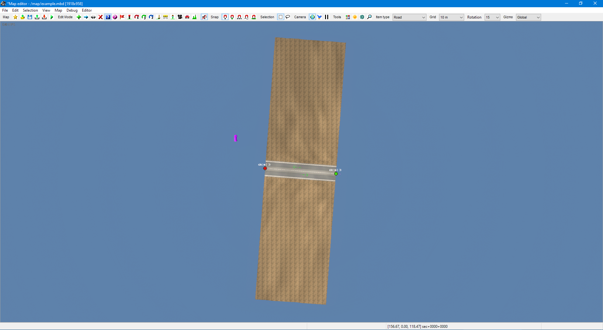
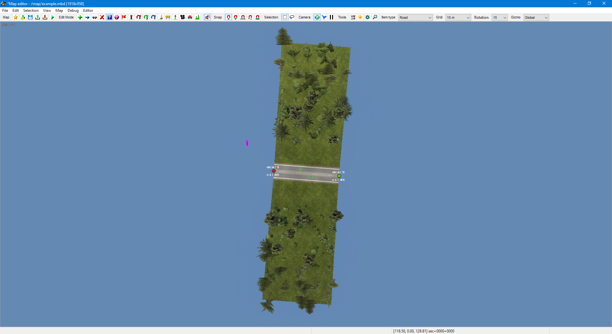
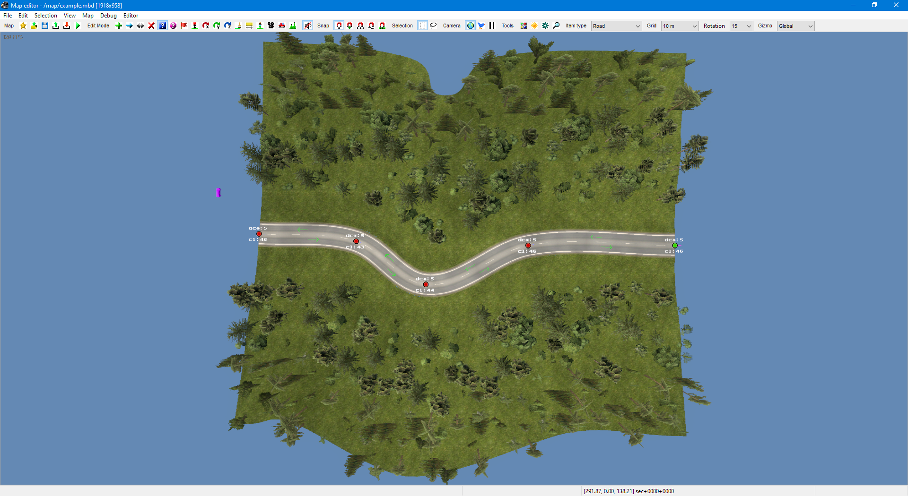
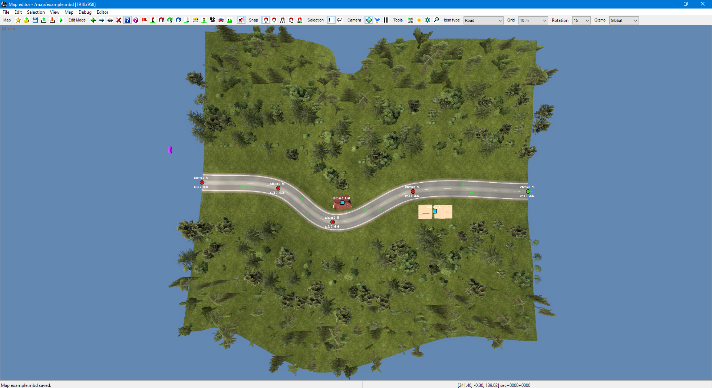

# Sample #1: Simple example

The following code demonstrates how to create a map, add items to it, and save it.
You can find the full source code at `Samples/00-SimpleExample/Program.cs`. 

## Instantiating the map
We begin by instantiating an empty map:

```cs
using TruckLib.ScsMap;

var map = new Map("example");
```

`"example"` is the filename of the map, meaning that, when the map is saved, it will be named
`example.mbd`, and its sectors will be written to the `example` directory.

## Adding a road item

Let's add a few road segments. For the sake of simplicity, we will be using hardcoded coordinates. Here's how
you can add one individual road item:

```cs
using System.Numerics;

var r = Road.Add(map,
    new Vector3(19, 0, 19.5f), // position of backward (red) node
    new Vector3(65, 0, 23),    // position of forward (green) node
    "ger1",  // unit name of the road type
    80, 80   // terrain size on the left and right side
    );
```

Each map item class has a static `Add` method for creating a new item of that type and adding it
to the map. In this case, we're adding a road item going from (19, 0, 19.5) to (65, 0, 23) of type
`ger1` ("ger road 1 tmpl") with 80 m wide terrain on both sides.

If you were to save the map here, it would look like this:



## Setting road properties
The next lines of code set the appearance of the road.

```cs
r.Right.Look = "ger_1";
r.Right.Variant = "broken_de";
r.Right.LeftEdge = "ger_sh_15";
r.Right.RightEdge = "ger_sh_15";
```

Note that `ger1` is a single carriageway. This means that properties affecting the carriageway itself
have to be set on the right side, as the left side is ignored by the game.

The following properties, however, do exist on both sides of the road, and we want them to be set on both.

```cs
foreach (var side in new[]{r.Left, r.Right})
{
```

First, we will define what the terrain will look like:

```cs
    side.Terrain.QuadData.BrushMaterials[0] = new Material("34"); // "grass_ger_main"
    side.Terrain.Profile = "profile12"; // "hills2"
    side.Terrain.Noise = TerrainNoise.Percent0;
    side.Terrain.Coefficient = 0.5f;
```

The following lines add some vegetation to that terrain:
```cs
    side.Vegetation[0].Name = "v2_1ger"; // "ger - mixed forest"
    side.Vegetation[0].Density = 200;
    side.Vegetation[0].From = 15;
    side.Vegetation[0].To = 80;
```

Lastly, let's place some bollards:
```cs
    side.Models[0].Name = "219"; // "reflective post"
    side.Models[0].Distance = 50;
    side.Models[0].Offset = 6;
}
```

The road item now looks like this:



## Appending to a road
We will now continue this road by appending some more segments:

```cs
r.Append(new Vector3(98, 0, 43.5f))
   .Append(new Vector3(146.5f, 0, 25))
   .Append(new Vector3(216, 0, 25));
```

`Append` creates a new road item going from the forward node of the road you called it on
to the given coordinate. Note that road items can only have one neighbor in either direction,
and therefore can only be appended to once &ndash; the reason `Append` can be chained like this is
because it returns the newly created road item.

We don't need to set all the properties again like we did with the first road item
because, by default, `Append` copies all properties to the new segment.

Our map now looks like this:



## Adding models
As the last step, we will place two models.

```cs
var model1 = Model.Add(map,
    new Vector3(103.75f, -0.3f, 31.73f), // position 
    "dlc_no_471", // unit name of "house_01_sc"
    "brick",      // variant
    "default"     // look
    );
model1.Node.Rotation = Quaternion.CreateFromYawPitchRoll(-2.99f, 0, 0);

var model2 = Model.Add(map, new Vector3(159.64f, -0.1f, 36.91f), 
    "378", // "wood_heap1"
    "default", "default"); 
model2.Node.Rotation = Quaternion.CreateFromYawPitchRoll((float)(Math.PI / 2), 0, 0);
```

## Saving the map
Let's now save the map. The following code will place it in the `user_map` directory (if you're not
on Windows, this will probably need to be adjusted):

```cs
var documents = Environment.GetFolderPath(Environment.SpecialFolder.MyDocuments);
var userMap = Path.Combine(documents, "Euro Truck Simulator 2/mod/user_map/map/");
map.Save(userMap, true);
```

There should now be a `example.mbd` and a `example` directory in `mod/user_map/map` and 
you should be able to load the map in the editor.

Remember to **recompute the map** (Map > Recompute map). This is necessary because TruckLib
does not calculate the bounding boxes of items. Once you did, this is what the final map
should look like:



## Further reading
* [The Map class](/TruckLib.ScsMap/map-class.md)
* [Working with polyline items](/TruckLib.ScsMap/polyline-items.md)