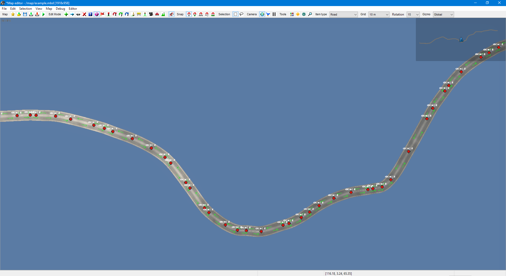

# Sample #3: Real world data

This sample demonstrates one possible approach for importing the course of a real road into a map for the purpose
of 1:1 mapping; in particular, it deals with the essential steps of fetching elevation data and projecting the points.
You can find the full source code at `Samples/02-RealRoad/Program.cs`.

## Structs
For convenience, we define the structs `GeographicCoordinate` and `ProjectedCoordinate`.

## Loading the data


Where you actually get the data from is out of scope for this sample, so I've provided a CSV file containing
WGS84 latitude/longitude coordinates describing the course of a road in Germany (© OpenStreetMap contributors).

```cs
var coordinates = LoadCoordinates();
```

We'll skip over `LoadCoordinates` here &ndash; it just loads the CSV file into a list of `GeographicCoordinate`s.

## Elevation
The majority of map data you will encounter will not have elevation data present, so we must fetch it ourselves. In this case,
we will use the [DEM.Net](https://github.com/dem-net/DEM.Net) library, which has a simple interface for getting the elevation of
points from several freely available elevation models.

DEM.Net uses the `Microsoft.Extensions.DependencyInjection` package, so to get an instance of the `ElevationService` class we need,
we will create a class `ElevationProvider` whose constructor takes one as an argument and a static method which requests an instance
of this class to be created:

```cs
using DEM.Net.Core;
using Microsoft.Extensions.DependencyInjection;

namespace RealRoad
{
    internal class ElevationProvider
    {
        private readonly ElevationService elevationService;
        private readonly DEMDataSet dataset = DEMDataSet.SRTM_GL1;

        public static ElevationProvider Create()
        {
            var serviceCollection = new ServiceCollection();
            serviceCollection.AddDemNetCore();
            serviceCollection.AddTransient<ElevationProvider>();
            var services = serviceCollection.BuildServiceProvider();
            return services.GetService<ElevationProvider>();
        }

        public ElevationProvider(ElevationService elevationService)
        {
            this.elevationService = elevationService;
        }
}
```

We now add a method to this class which takes in the coordinates we just loaded and looks up the elevation at these points:

```cs
public void SetElevations(List<GeographicCoordinate> points)
{
    var geoPoints = elevationService.GetPointsElevation(
        points.Select(p => new GeoPoint(p.Latitude, p.Longitude)), 
        dataset).ToList();
    for (int i = 0; i < points.Count; i++)
    {
        var point = points[i];
        point.Height = geoPoints[i].Elevation ?? 0;
        points[i] = point;
    }
}
```

Finally, we'll call it from Main:

```cs
var elevationProvider = ElevationProvider.Create();
elevationProvider.SetElevations(coordinates);
```

Our coordinates now have elevations associated with them. The first time you run this program, this step will take several seconds
as DEM.Net needs to download the elevation model for the requested region; on any subsequent run, it will load a cached version from disk.

Note that this is a primitive approach with one big disadvantage: we sample the elevation model at these particular points, but ignore elevation
changes that happen in between. If you had two points which are 200 m apart, and within that distance the road goes slightly uphill,
then downhill again, this elevation change would not be present in the road items we are about to place.

## Projection
The real world is round, but game worlds are flat, so we need to project our points into that flat world. Here, we will use a transverse Mercator;
more specifically, UTM zone 32N, which is the UTM zone most of Germany falls into. The library
[DotSpatial.Projections](https://www.nuget.org/packages/DotSpatial.Projections) will do this for us.

The method for projecting our list of coordinates looks like this:

```cs
using DotSpatial.Projections;

static List<ProjectedCoordinate> Project(IList<GeographicCoordinate> coordinates, 
    ProjectionInfo source, ProjectionInfo dest)
{
    // Convert our list into the flat array expected by the library
    var xy = new double[coordinates.Count * 2];
    for (int i = 0; i < coordinates.Count; i++)
    {
        xy[i * 2] = coordinates[i].Longitude;
        xy[(i * 2) + 1] = coordinates[i].Latitude;
    }

    // Project the points in-place
    Reproject.ReprojectPoints(xy, null, source, dest, 0, coordinates.Count);

    // And convert it back into a list of ProjectedCoordinates
    var points = new List<ProjectedCoordinate>(coordinates.Count);
    for (int i = 0; i < coordinates.Count; i++)
    {
        var easting = xy[i * 2];
        var northing = xy[(i * 2) + 1];
        points.Add(new ProjectedCoordinate(easting, northing, coordinates[i].Height));
    }
    return points;
}
```

And this is how we call it:

```cs
var sourceCrs = KnownCoordinateSystems.Geographic.World.WGS1984;
var destCrs = KnownCoordinateSystems.Projected.UtmWgs1984.WGS1984UTMZone32N;
var points = Project(coordinates, sourceCrs, destCrs);
```

We now have a list of `ProjectedCoordinate`s. Let's also define a center point for our map, which we will subtract
from our projected coordinates later:

```cs
var center = Project(new[] { new GeographicCoordinate(54.744101, 9.799639) },
    sourceCrs, destCrs)[0];
```

## Adding the road to the map
We now have everything we need to add the road to a map. For this step, I will assume that you have read
[Sample #1: Simple example](~/docs/Samples/00-simple.md).

As with the previous samples, we'll create an empty map:

```cs
using TruckLib.ScsMap;

var map = new Map("example");
```

The road items can be created as follows:

```cs
var road = Road.Add(map,
    PointToNodePosition(points[0], center),
    PointToNodePosition(points[1], center),
    "ger1");

for (int i = 2; i < points.Count; i++)
{
    road = road.Append(PointToNodePosition(points[i], center));
}
```

(The method `PointToNodePosition` simply subtracts the center point and inverts the Z coordinate.)

The first road item needs to be explicitly created with the first and second point of the road. After this,
you can call `Append` in a loop with the remaining points. Remember that a road item can only be appended to once, so
make sure to assign the return value of `Append`, which is the newly created road item, back to `road`.

## Saving the map
You know the drill by now:

```cs
var documents = Environment.GetFolderPath(Environment.SpecialFolder.MyDocuments);
var userMap = Path.Combine(documents, "Euro Truck Simulator 2/mod/user_map/map/");
map.Save(userMap, true);
```

Remember to **recompute the map** (Map > Recompute map). This is necessary because TruckLib
does not calculate the bounding boxes of items.

This is what you should see:



## Further reading
* [Sample #1: Simple example](~/docs/Samples/00-simple.md)
* [Working with polyline items](~/docs/TruckLib.ScsMap/polyline-items.md)
